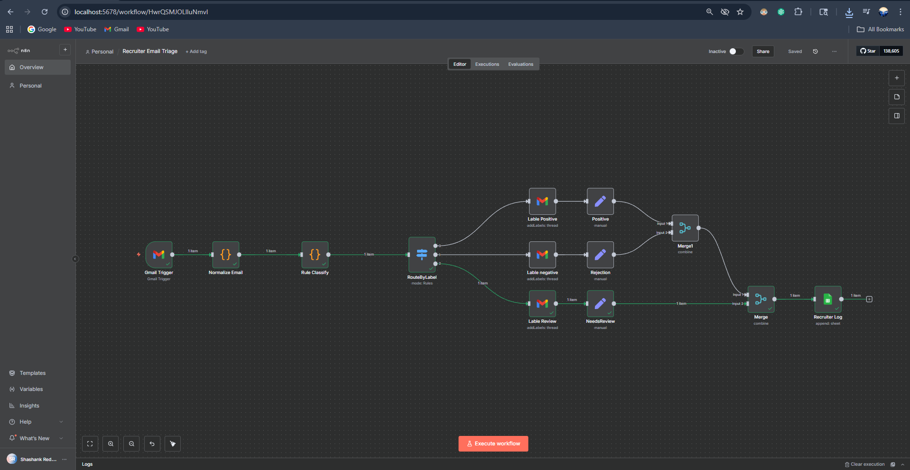

# Recruiter Email Classification & Logging Automation (n8n)

This project automates the processing of recruiter emails using [n8n](https://n8n.io), Gmail, and Google Sheets.  
It classifies inbound emails into categories (*Positive*, *Rejection*, *Needs Review*), applies Gmail labels, and logs structured results to a Google Sheet.

## 🚀 Features
- **Gmail Trigger:** Captures new recruiter emails in real-time.
- **Rule-based Classifier:** Regex-based classification of email subject/snippet into 3 categories.
- **RouteByLabel (Switch):** Routes each classified email to the right Gmail label branch.
- **Google Sheets Logging:** Appends metadata (`from`, `subject`, `snippet`, `finalLabel`, `finalConfidence`, `routePath`) for tracking recruiter communications.
- **Merge Logic:** Ensures all paths unify into a single stream for logging.
- **Daily Batch Mode (optional):** Workflow variant to analyze all emails from the current day in one run.

## 🛠️ Tech Stack
- [n8n](https://n8n.io) (workflow automation)
- Gmail API (trigger & labeling)
- Google Sheets API (logging)
- JavaScript (custom code nodes for regex-based classification)

## 📊 Workflow Diagram

## 📂 Repo Contents
- `workflow.json` — Exported n8n workflow (you can import this directly into your n8n instance).
- `workflow_diagram.png` — Visual diagram of the workflow.
- `examples/test_emails.json` — Sample dataset to test classification logic.

## ▶️ Usage
1. Clone this repo.
2. Import `workflow.json` into your n8n instance.
3. Configure Gmail + Google Sheets credentials in n8n.
4. Run the workflow (either via Gmail Trigger or schedule a daily batch run).

## 📈 Outcomes
- Reduced manual triage of recruiter emails.
- Consistent, structured tracking in Google Sheets.
- Flexible: supports both **real-time trigger mode** and **batch mode**.

---

*Built using n8n for workflow automation.*
